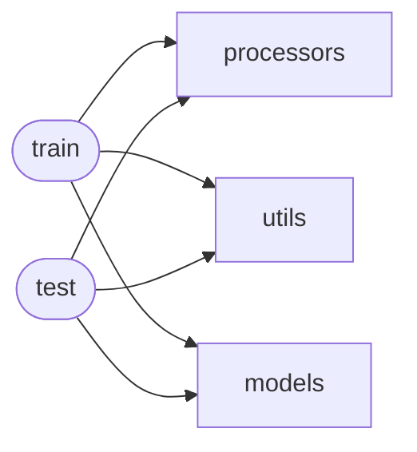

# Code Overview

[_Documentation generated by Documatic_](https://www.documatic.com)

<!---Documatic-section-Codebase Structure Python-start--->
## Codebase Structure Python

The codebase has a single-depth folder structure,
                with 16 code files in total.

<!---Documatic-block-system_architecture-start--->

<!---Documatic-block-system_architecture-end--->

# #
<!---Documatic-section-Codebase Structure Python-end--->

<!---Documatic-section-File IO-start--->
## File IO

<!---Documatic-block-file_io-start--->
The following files have file read operations

<!---Documatic-block-src.models-start--->

	
<code>src.models</code> (Click to Expand!)

* src.models.base_model

<!---Documatic-block-src.models-end--->

<!---Documatic-block-src.processors-start--->

	
<code>src.processors</code> (Click to Expand!)

* src.processors.optimizer

<!---Documatic-block-src.processors-end--->

<!---Documatic-block-src.utils-start--->

	
<code>src.utils</code> (Click to Expand!)

* src.utils.dataset

<!---Documatic-block-src.utils-end--->

The following files have file write operations

<!---Documatic-block-src.models-start--->

	
<code>src.models</code> (Click to Expand!)

* src.models.base_model

<!---Documatic-block-src.models-end--->

<!---Documatic-block-src.processors-start--->

	
<code>src.processors</code> (Click to Expand!)

* src.processors.optimizer

<!---Documatic-block-src.processors-end--->
<!---Documatic-block-file_io-end--->

# #
<!---Documatic-section-File IO-end--->

<!---Documatic-section-Class Hierarchy-start--->
## Class Hierarchy

<!---Documatic-block-BaseModel-start--->

	
<code>BaseModel</code> (Click to Expand!)

* src.models.distmult.DistMult

<!---Documatic-block-BaseModel-end--->

<!---Documatic-block-Optimizer-start--->

	
<code>Optimizer</code> (Click to Expand!)

* src.processors.optimizer.Adagrad
* src.processors.optimizer.SGD

<!---Documatic-block-Optimizer-end--->

<!---Documatic-block-object-start--->

	
<code>object</code> (Click to Expand!)

* src.processors.trainer.NegativeGenerator
* src.processors.trainer.Trainer
* src.utils.dataset.Dataset
* src.utils.dataset.Vocab
* src.utils.graph.TensorTypeGraph

<!---Documatic-block-object-end--->

<!---Documatic-block-src.models.param.LookupParameter-start--->

	
<code>src.models.param.LookupParameter</code> (Click to Expand!)

* src.models.param.LookupParameter

<!---Documatic-block-src.models.param.LookupParameter-end--->

<!---Documatic-block-src.processors.trainer.NegativeGenerator-start--->

	
<code>src.processors.trainer.NegativeGenerator</code> (Click to Expand!)

* src.processors.trainer.UniformNegativeGenerator

<!---Documatic-block-src.processors.trainer.NegativeGenerator-end--->

<!---Documatic-block-src.processors.trainer.Trainer-start--->

	
<code>src.processors.trainer.Trainer</code> (Click to Expand!)

* src.processors.trainer.PairwiseTrainer
* src.processors.trainer.SingleTrainer

<!---Documatic-block-src.processors.trainer.Trainer-end--->

<!---Documatic-block-src.utils.dataset.Dataset-start--->

	
<code>src.utils.dataset.Dataset</code> (Click to Expand!)

* src.utils.dataset.TripletDataset

<!---Documatic-block-src.utils.dataset.Dataset-end--->

# #
<!---Documatic-section-Class Hierarchy-end--->

[_Documentation generated by Documatic_](https://www.documatic.com)